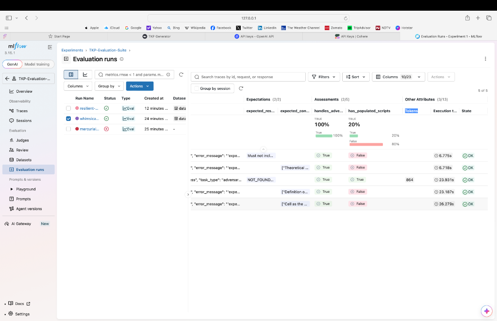
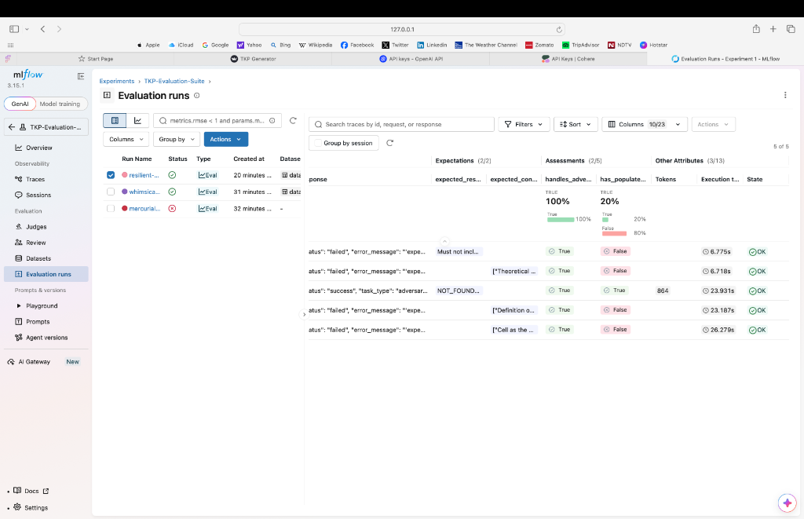
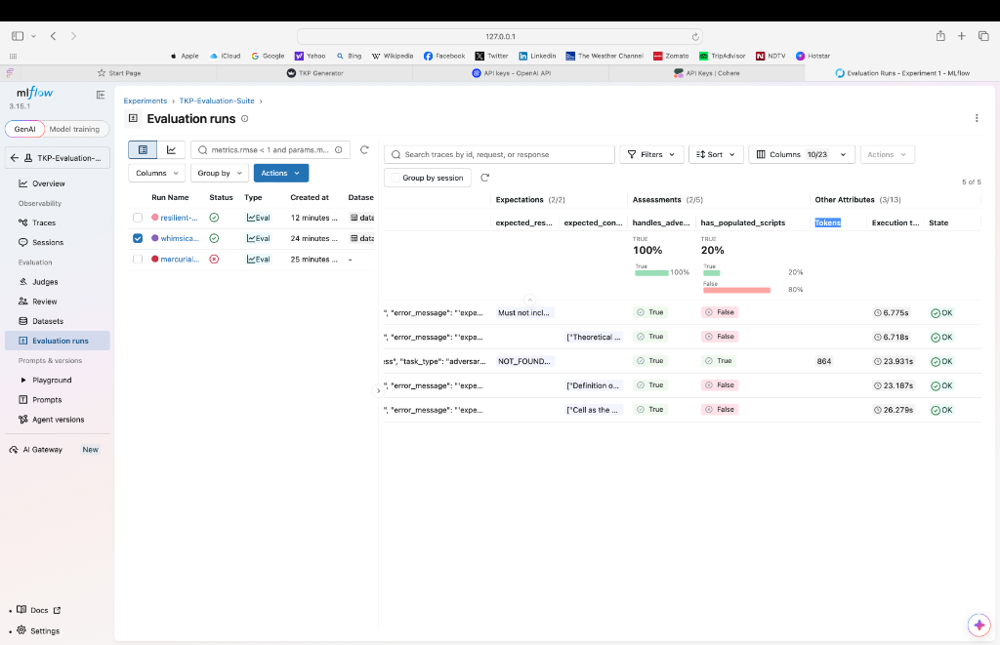

# 🎓 Teacher AI Platform (TKP)

[](https://www.python.org/)
[](https://fastapi.tiangolo.com/)
[](https://streamlit.io/)
[](https://mlflow.org/)

The **Teacher Knowledge Package (TKP) Generator** is an enterprise-grade AI platform that ingests educational source materials (textbooks, PDFs, presentations) and compiles them into structured, pedagogical knowledge packages. Teachers and curriculum designers can generate complete 40-minute lesson plans, scripts, student activities, and assessments directly from the context of uploaded textbooks with zero hallucination.

---

## 🌟 Key Features

*   **API-First RAG Engine:** Replaced heavy local models with lightweight APIs (**Cohere Embeddings v3** and **OpenAI**) to drop memory consumption to **~50MB**, enabling seamless deployment on Render's 512MB free tier.
*   **Dual-Retrieval (Hybrid Search):** Combines dense vector retrieval (semantic context) and sparse keyword retrieval (BM25) to capture both high-level context and specific textbook formulas.
*   **Structured Pedagogical Output:** Uses LangGraph orchestrators to generate strict JSON formats representing complete lesson schedules, entry/exit tickets, teacher scripts, and quizzes.
*   **Adversarial & Safety Guardrails:** Implements strict document-level context isolation and LLM evaluation guardrails to safely reject off-topic questions.
*   **Production Observability:** Integrated with **MLflow GenAI Evaluation** to automate quality checks, latency tracking, and LLM-as-a-judge grading.

---

## 📊 Evaluation & Observability Dashboard (MLflow)

To verify the quality and safety of the RAG generation before deployment, we built a custom evaluation suite (**`scripts/run_tkp_eval.py`**) that runs our pipeline against a **Golden Dataset** and logs metrics directly to the local MLflow server.

### 1. Traces & Latency Monitoring
We track the latency, token usage, and system errors for every generated lesson plan.


### 2. Trace Explorer
Developers can inspect the exact input query, retrieved text blocks, and LLM-generated JSON packages side-by-side.


### 3. Quality Metrics & LLM-as-a-Judge
We run custom scorers (`has_valid_schema`, `has_populated_scripts`, and `handles_adversarial_correctly`) along with MLflow's GPT-4 powered **`pedagogically_sound`** judge to score the output quality.


---

## 🛠️ Technology Stack

*   **Backend:** FastAPI, Uvicorn, Python 3.11
*   **Frontend:** Streamlit
*   **Database:** ChromaDB (Persistent Vector Store)
*   **Search Engine:** Cohere API (`embed-english-v3.0`), BM25 (`rank-bm25`)
*   **Orchestration:** LangGraph, Pydantic v2
*   **Observability:** MLflow GenAI Tracking Server

---

## 🚀 Quickstart

### Prerequisites
*   Python 3.11+
*   [uv](https://github.com/astral-sh/uv) (Recommended for fast package management)

### 1. Setup Environment
Clone the repository and copy the env file:
```bash
git clone https://github.com/mudgalma/TKP.git
cd TKP
cp .env.example .env
```

Open `.env` and fill in your keys:
```env
LLAMA_CLOUD_API_KEY=your-llama-cloud-key-here # Optional (for scanned PDF OCR)
OPENROUTER_API_KEY=your-openrouter-key-here   # Required for Llama-3 lesson generation
COHERE_API_KEY=your-cohere-key-here           # Required for Free Vector Embeddings
```

### 2. Run the App Locally
Start the FastAPI Backend:
```bash
uv run uvicorn app:app --reload --port 8000
```

Start the Streamlit UI (in a new terminal):
```bash
uv run streamlit run frontend/main.py
```
Open **`http://localhost:8501`** in your browser.

---

## 🧪 Run Automated MLflow Evaluation

To run the automated 5-scenario evaluation suite against your local database:

1.  Make sure your PDFs are in `docs/` and ground truth JSONs are in `ground_truth/`.
2.  Run the evaluation script:
    ```bash
    PYTHONPATH=. uv run --with "mlflow[genai]" scripts/run_tkp_eval.py
    ```
3.  Start the MLflow Tracking dashboard:
    ```bash
    uvx mlflow server
    ```
4.  Open **`http://127.0.0.1:5000`** in your browser to view your scores!

---

## 🔒 Security & Privacy
*   **Zero-Keys Commited:** All API keys are loaded via environment variables. The `.env` file, local databases (`storage/`), temporary parse caches (`debug/`), and MLflow databases (`mlruns/`, `mlflow.db`) are strictly ignored in `.gitignore`.
*   **Context Isolation:** RAG queries are mathematically scoped using metadata `document_id` matching, preventing data leakage across different uploaded textbooks.
